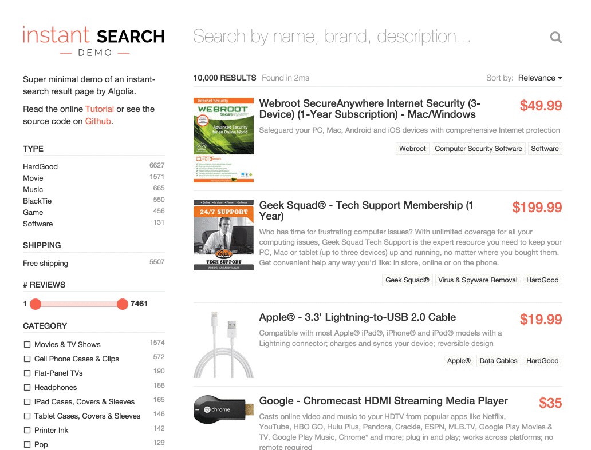

Instant-Search Demo
====================

This is a sample project implementing an instant-search based e-commerce website with [Algolia](http://www.algolia.com). Algolia is a Search API that provides hosted full-text, numerical and faceted search.

#### Features
* Full JavaScript (based on [jQuery](http://jquery.com/), [Hogan.js](http://twitter.github.io/hogan.js/) and [AlgoliaSearch](https://github.com/algolia/algoliasearch-client-js))
* Results page refreshed as you type
* Hits
* Facets
* Pagination
* Relevant results from the first keystroke
* Typo-tolerance
* Multiple sort orders
* By Relevance
* By Highest Price
* By Lowest Price
* Backup search parameters in the URL

Usage
------
We've included some credentials in the code allowing you to test the demo without any Algolia account. If you want to replicate this demo using your own Algolia credentials, you can use the ```push.rb``` script to send the data and configure the indices.

```
./push.rb YourApplicationID YourAPIKey YourIndexName
```

Then, you'll need to replace the demo credentials with your own:
- in ```js/app.js```, set your own ```APPLICATION_ID``` instead of ```"latency"``` (which is our demo ```APPLICATION_ID```),
- in ```js/app.js```, set your own ```SEARCH_ONLY_API_KEY``` instead of ```"6be0576ff61c053d5f9a3225e2a90f76"```,
- in ```js/app.js```, set your own ```index``` name instead of ```"bestbuy"```.

Data Set
---------
We've extracted 10,000 products from the [Best Buy Developer API](https://developer.bestbuy.com). You can find the associated documentation [here](https://developer.bestbuy.com/documentation/products-api).


Demo
-----


