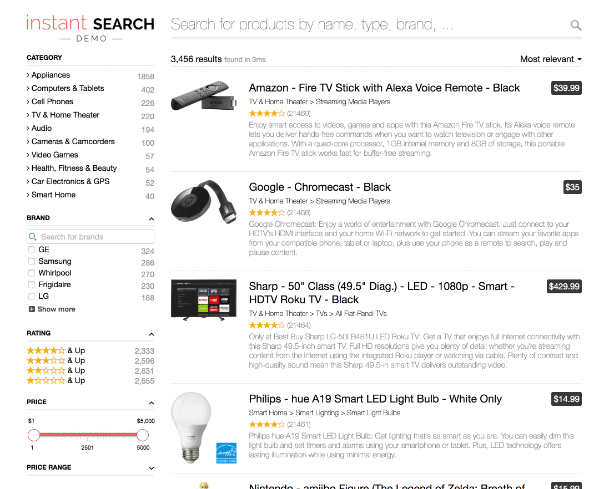

**Note:** this repository is hosting the demo that was previously located at [algolia/examples](https://github.com/algolia/examples/tree/master/instant-search/instantsearch.js/)

-----

Instant-Search Demo
====================

This is a sample project of an [Algolia](http://www.algolia.com) Instant-Search result page on an e-commerce website. Algolia is a Search API that provides a hosted full-text, numerical and faceted search.

## Demos
Try out the [demo](https://preview.algolia.com/instantsearch/)


### Simplified version
This project also includes a simplified version of the implementation that includes a few less filtering options.
The code is available in the files `index-simplified.html` and `search-simplified.js`. You can [see it live here](https://preview.algolia.com/instantsearch/index-simplified.html).

## Features
* Full-JavaScript/frontend implementation based on [instantsearch.js](https://community.algolia.com/instantsearch.js/)
* Results page refreshed as you type
* Relevant results from the first keystroke
* Rich set of filters
  * Multi-level categories
  * Range slider
  * Star rating
* Typo-tolerance
* Multiple sort orders
  * By Relevance
  * By Highest Price
  * By Lowest Price
* Backup search parameters in the URL

## Run and develop locally

First, [install nvm](https://github.com/creationix/nvm#installation), then run:

```sh
git clone git@github.com:algolia/instant-search-demo.git
cd instant-search-demo
nvm use
npm install
npm start
open http://localhost:3000
```

We've included some credentials in the code allowing you to test the demo without any Algolia account.

### Data import
If you want to replicate this demo using your own Algolia credentials that you can obtain creating a free account on Algolia.com.

Just install the Ruby `algoliasearch` gem and use the `push.rb` script to send the data and automatically configure the product index (same for both versions).

```sh
$ gem install algoliasearch
$ ./dataset_import/push.rb YourApplicationID YourAdminAPIKey YourIndexName
```

Then, you'll need to replace the demo credentials with your own:
- in `search.js` and `search-simplified.js`, set your own `APPLICATION_ID` instead of `"latency"` (which is our demo `APPLICATION_ID`),
- in `search.js` and `search-simplified.js`, set your own `SEARCH_ONLY_API_KEY` instead of `"6be0576ff61c053d5f9a3225e2a90f76"`,
- in `search.js` and `search-simplified.js`, set your own `index` name instead of `"instant_search"`.


We've extracted 20 000+ products from the [Best Buy Developer API](https://developer.bestbuy.com). You can find the associated documentation [here](https://developer.bestbuy.com/documentation/products-api).

## Tutorial

**Follow this [step by step tutorial](https://www.algolia.com/doc/tutorials/search-ui/instant-search/build-an-instant-search-results-page/instantsearchjs/) (on Algolia.com) to learn how this implementation works** and how it has been built using the [instantsearch.js library](https://community.algolia.com/instantsearch.js/).

A more general overview of filtering and faceting is available in a [dedicated tutorial](https://www.algolia.com/doc/tutorials/search-ui/instant-search/filtering/faceting-search-ui/instantsearchjs/).

